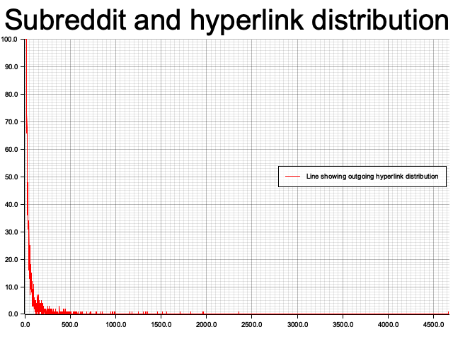

# DS210_project
CDS DS 210 Final Project Repository

- Graph shape follows a power law distribution
This project is based on the Reddit Hyperlink Network Dataset provided by Stanford Network Analysis Project website. The website showcases two datasets, both that have information gathered ...

# What the dataset looked like
The dataset had a lot of information that I didn't need. The last column contained information regarding the properties of the post, such as the number of characters, the number of words, etc. The only columns I needed were the source_subreddit, target_subreddit and post_id. I had originally planned to create multiple graphs showcasing the difference in vertex distributions based on post sentiment, but I unfortunately did not have enough time to do so.
# What I did
I decided my first steps had to be creating a HashMap with the names of all subreddits as the keys and a unique identification number as values. These ID numbers were numbered 0 to n, where n is the total number of subreddits present in the data. I also created a vector of tuples which contained line by line each origin to destination subreddit pair which would be used to create my adjacency list.
I created the adjacency list by going through the vector of tuples and using the unique ID from the HashMap. I allowed for duplicates in the adjacency list as I want to see the total number of connections between subreddits and different posts can originate on one subreddit and link to the same destination subreddit. As I went through each line of the subreddit-subreddit pairs vector, I changed the adjacency list each time. 
After completing the adjacency list, I created a graph by using code provided in Professor Leonidas' lecture.
I then decided to create a vector of xy coordinates to plot the vertex connections. I did this by finding the subreddit with the highest number of outgoing links and then creating a vector of tuples with the outgoing number of links as one coordinate and the number of subreddits that each had the same number of outgoing links:
$l$ = number of outgoing links, $x$ = number of subreddits that had $x$ outgoing links
$\begin{bmatrix}(l_0= 0, x_0 = ?) \\ (l_1 = 1, x_1 = ?) \\ \vdots \\ (l_n = n, x_n = ?)\end{bmatrix}$
After creating this vector of tuples, I quickly noticed tha most of the subreddits didn't have any outgoing links and I remembered that not every subreddit in this dataset is going to have had a post which linked to another. There are so many subreddits that it would be crazy to assume so. 

My next step was to start graphing. I used some code on the (insert stuff here) to create my plot. I changed it accordingly 
it managed to create the distribution of outgoing vertices like I'd hoped.

Unfortunately, it is clear that the distribution of outgoing vertex connections cleary resembeled that of a power law distribution, just as the professor said. The actual number of subreddits with 0 outgoing connections is a lot larger than what the graph showcases, I  created an artifical limit in the graph so that it was easier to see the other number of outgoing links. The subreddit with the largest number of outgoing links was called??? and it had 4000??? outgoing links. I honestly couldn't believe it and then when I searched it up I very quickly realized why [...].
The next subreddits were [...]
# Overview of modules
    1- pub mod file_and_hashmap_stuff
This public module contains all the functions used to go through the file and create all the necessary vectors and hashmaps needed
    2- pub mod graph stuff
This public module contained the code used to create the graph structure using the adjacency list
3-   j