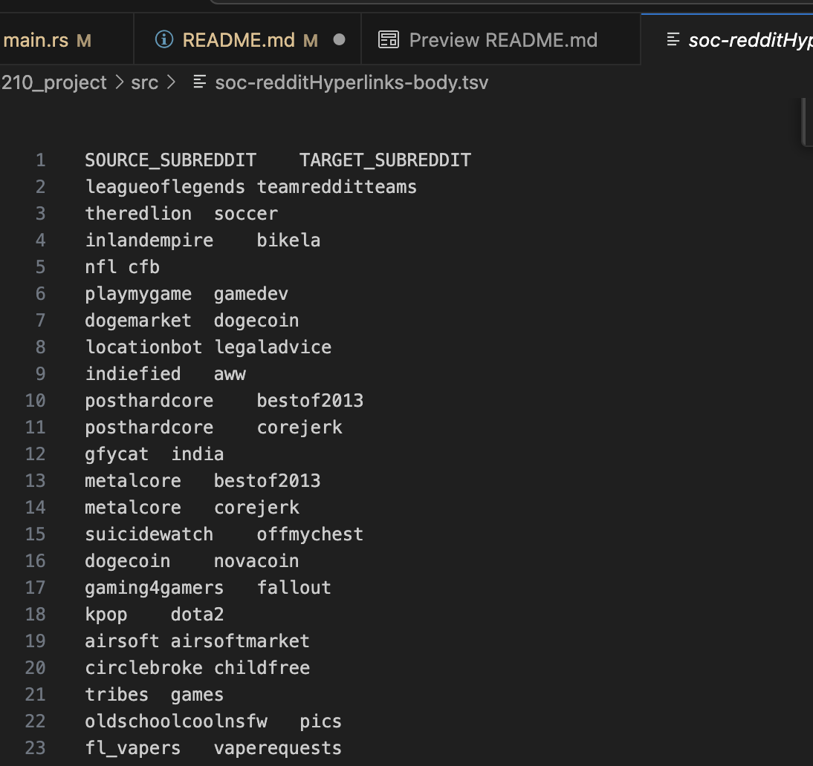

# CDS DS 210 Fall 2023 final project write up
Created by Sulaf Ali Jaafar Al Jabal for CDS DS 210 Fall 2023 with professor Leonidas Kontothanassis

This project is based on the Reddit Hyperlink Network Dataset provided by Stanford Network Analysis Project website. The website showcases two datasets, both that have information gathered between January 2014 and April 2017. 
https://snap.stanford.edu/data/soc-RedditHyperlinks.html
The two datasets provided information about subreddit to subreddit interactions between 2014 and 2017, with one dataset showcasing subreddit-to-subreddit hyperlinks extracted from the headers of posts and the other from the main body of posts. I decided to use the second dataset as I believed there would be more connections.

## What did I want to do?
I wanted to showcase the connections between subreddits and see what kind of distrbutions this dataset would follow.

##  What the dataset looked like
The dataset had a lot of information that I didn't need. The last column contained information regarding the properties of the post, such as the number of characters, the number of words, etc. The only columns I needed were the source_subreddit, target_subreddit and post_id. I had originally planned to create multiple graphs showcasing the difference in vertex distributions based on post sentiment, but I unfortunately did not have enough time to do so.
After removing what I needed, the dataset looked like this


# What I did
I decided my first steps had to be creating a HashMap with the names of all subreddits as the keys and a unique identification number as values. These ID numbers were numbered 0 to n, where n is the total number of subreddits present in the data. I also created a vector of tuples which contained line by line each origin to destination subreddit pair which would be used to create my adjacency list.

I created the adjacency list by going through the vector of tuples and using the unique ID from the HashMap. I allowed for duplicates in the adjacency list as I want to see the total number of connections between subreddits and different posts can originate on one subreddit and link to the same destination subreddit. As I went through each line of the subreddit-subreddit pairs vector, I changed the adjacency list each time. 

After completing the adjacency list, I created a graph by using code provided in Professor Leonidas' lecture notes. I used a for loop to go through the newly created graph structure and append any new subreddits and their connections and incremented the number of vertices in the graph by 1.

I then decided to create a vector of xy coordinates to plot the vertex connections. I did this by finding the subreddit with the highest number of outgoing links and then creating a vector of tuples with the outgoing number of links as one coordinate and the number of subreddits that each had the same number of outgoing links:

$x$ = number of outgoing links, $y$ = number of subreddits that had $y$ outgoing links
$\begin{bmatrix}(x_0= 0, y_0 = ?) \\ (x_1 = 1, y_1 = ?) \\ \vdots \\ (x_n = n, y_n = ?)\end{bmatrix}$
After creating this vector of (empty) tuples, I quickly noticed tha most of the subreddits didn't have any outgoing links and I remembered that not every subreddit in this dataset is going to have had a post which linked to another. There are so many subreddits that it would be crazy to assume so. 

After initially creating the vector, I used some graph traversal code provided once again by Professor Leonidas' lecture notes to change the vector of xy coordinates. The graph structure used was this:
```
pub struct Graph {
    n: usize,
    outedges: AdjacencyList,
}
```
The named field outedges contains a variable type AdjacencyList which looks like this 
``` 
pub type AdjacencyList = Vec<Vec<Vertex>>;
```
With the variable type Vertex just being a usize 
```
pub type Vertex = usize;
```
I traversed the graph by going through the outedges which contained all the outgoing edges for each subreddit uniquely numbered from 0 to n. As I went through each subreddit, I changed the xy coordinates vector accordingly. If, for example, subredit 5 contained 100 outgoing links, the coordinate pairs in the xy vector corresonding to 100 links ($x_{100}$) would be incremented by 1 ($y_{100} = y_{100} + 1$). After going through the entire graph structure, I now had a complete vector of tuples which I could graph and m next step was to start graphing. 

I used some code provided on GitHub by the Plotters crate which is used to create plots on rust:   
https://github.com/plotters-rs/plotters#quick-start  
https://plotters-rs.github.io/home/#!/  
I changed it accordingly to create my graph as the original provided a way to graph a quadratic function.
It managed to create the distribution of outgoing vertices like I'd hoped.


Unfortunately, it is clear that the distribution of outgoing vertex connections cleary resembeled that of a power law distribution, just as the professor said in a lecture. The actual number of subreddits with 0 outgoing connections is a lot larger than what the graph showcases, I created an artifical limit in the graph so that it was easier to see the other number of outgoing links. The subreddit with the largest number of outgoing links was called "subredditdrama" and it had 4665 outgoing links. When I looked at the name it made sense.

### What happens when the code runs?
The code showcases:
- The number of unique subreddits present in the hasmap I made
- The number of subreddit pairs (or number of records in file soc-redditHyperlinks-body.tsv)
- The number of vertices in the graph (which is the same as the number of unique subreddits)
# Overview of modules
    1- pub mod file_and_hashmap_stuff
This public module contains all the functions used to go through the file and create all the necessary vectors and hashmaps needed
    2- pub mod graph stuff
This public module contained the code used to create the graph structure using the adjacency list
3-   j